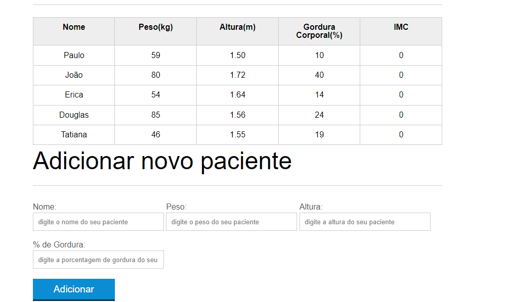

<h1>Tabela Que calcula o IMC de pacientes</h1>

Projeto utilizando HTML, CSS e Javascript

<h2>Alguns assuntos abordados no projeto</h2>
<ul>
    <li>Manipulação da DOM</li>
    <li>Arrays</li>
    <li>Formularios</li>
    <li>Validações</li>
    <li>AJAX para budcsr pacientes</li>
    <li>Entre Outros...</li>
</ul>

